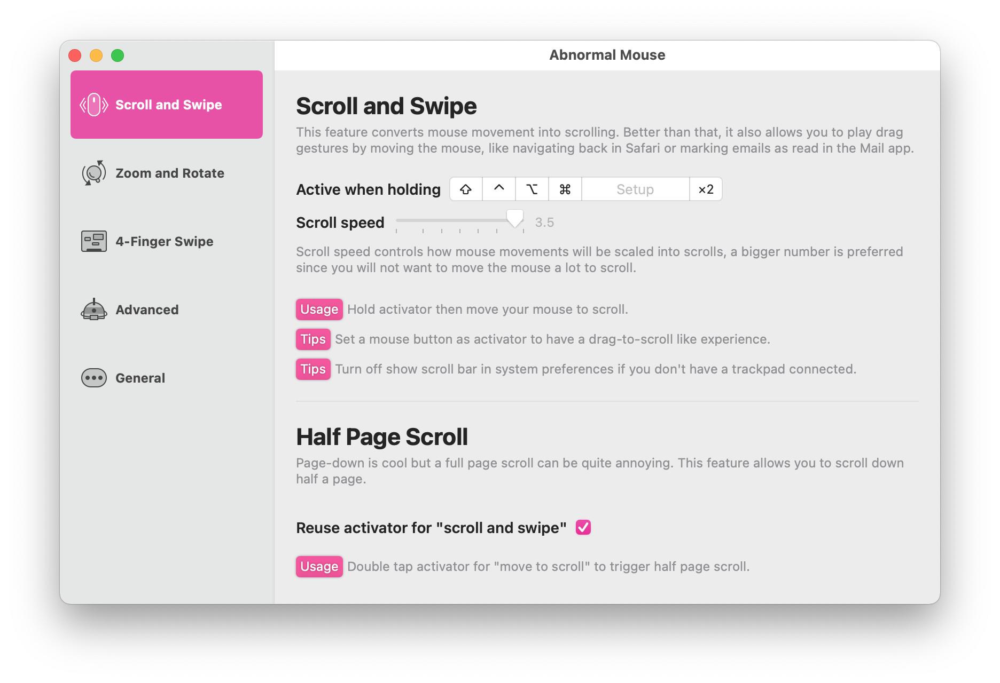

# Abnormal Mouse 

## Public Archived

You can [download the latest version here](https://abnormalmouse.intii.com). It's completely free to use. The project is not compilable any more so please don't waste any time forking or building it.

## About the App

At the end of 2019, I bought a strange mouse with an angular shape, an arrow key, a pair of AB keys, and an almost unusable touch scroll wheel. It would be a nice decoration if I didn't think of it as a mouse. Because of the epidemic of Covid-19, I decided not to bring my MacBook Pro to work. I had to use a Mac Mini at work, and I couldn't find a reason to buy another Magic Mouse to use in the office, I decided to use the strange mouse.

Using a normal mouse in macOS is a terrible thing, the missing gestures and four-way scrolling is a huge problem. For example, there's no way to pan left or right when looking at UI designs. And Swish, my favorite window management tool, doesn't work anymore. So I decided to write an app to fix it, trying to trigger these features by just moving the mouse (and holding some buttons).

### The currently supported features are

- Four-way scrolling (drag-to-scroll by holding down the trigger button and moving the mouse, which may seem odd, but I kind of like it).
- Half page down.
- Two-finger swipe gestures (Safari's swipe to back, Reeder's pull to refresh, etc.).
- Zoom and rotate.
- Four-finger swipe gestures (Switch between spaces, Mission Control).
