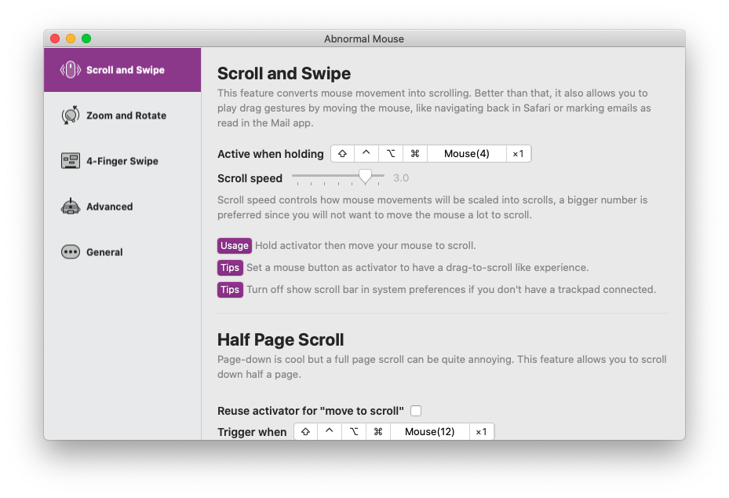

# Abnormal Mouse 

## 使用方法

你可以前往[这里下载最新版](https://abnormalmouse.intii.com/zh-cn)并免费使用它。

## 关于这个 app

2019年末我买了一只十分奇特的鼠标，它有棱角分明的外形、一个方向键、一对 AB 键以及一个几乎不可用的触控滚轮，如果不把它当鼠标看，它应该算是一个不错的装饰品。今年因为疫情我决定不再带 MacBook Pro 上班，然而公司只给了我一台垃圾 Mac Mini，贫穷的我找不到再买一个 Magic Mouse 放公司的理由，就决定启用这只鼠标。

在 macOS 中使用一般鼠标本身就是一件很糟糕的事情，用不了手势操作、无法进行四向滚动给我带来了很大的麻烦。比如看 UI 设计的时候没有办法通过鼠标左右平移、我很喜欢的窗口管理工具 Swish 也没法用了，于是我决定写个 app 改善一下，通过移动鼠标去触发这些功能。

### 目前支持的功能有：
- 四向滚动（通过按住触发键移动鼠标进行“拖拽”滚动，用起来可能会很奇怪，但我自己还挺喜欢的）。
- 半页下翻。
- 双指轻扫手势（Safari 的右划返回、Reeder 的下拉刷新等）。
- 缩放、旋转、只能缩放。
- 四指轻扫手势（切换 Space、呼出 Mission Control）。
